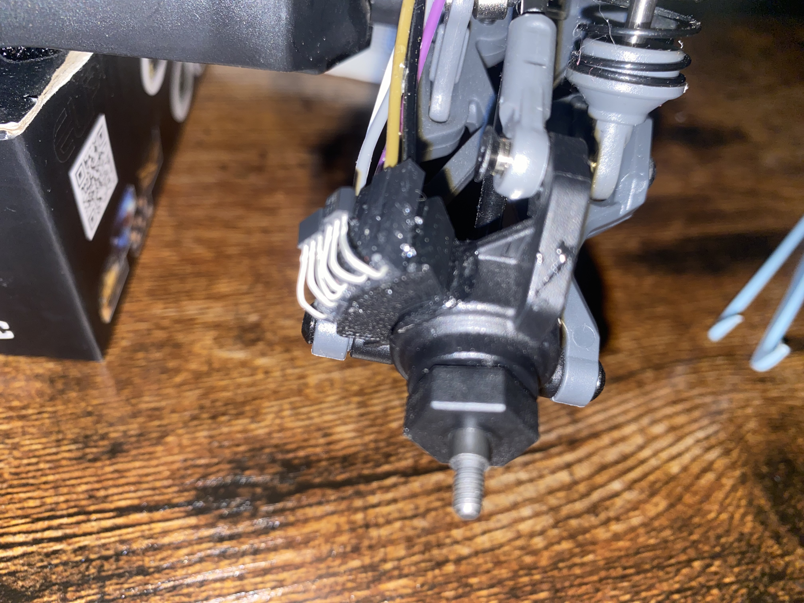
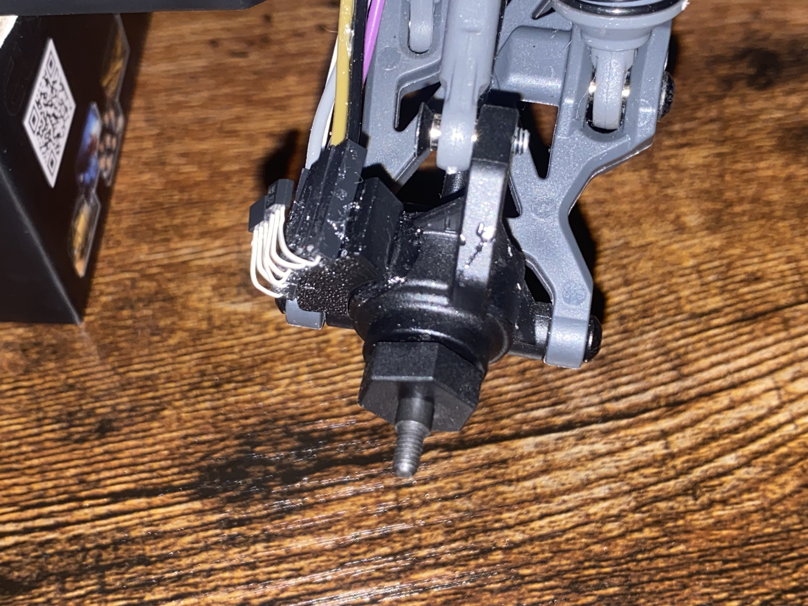
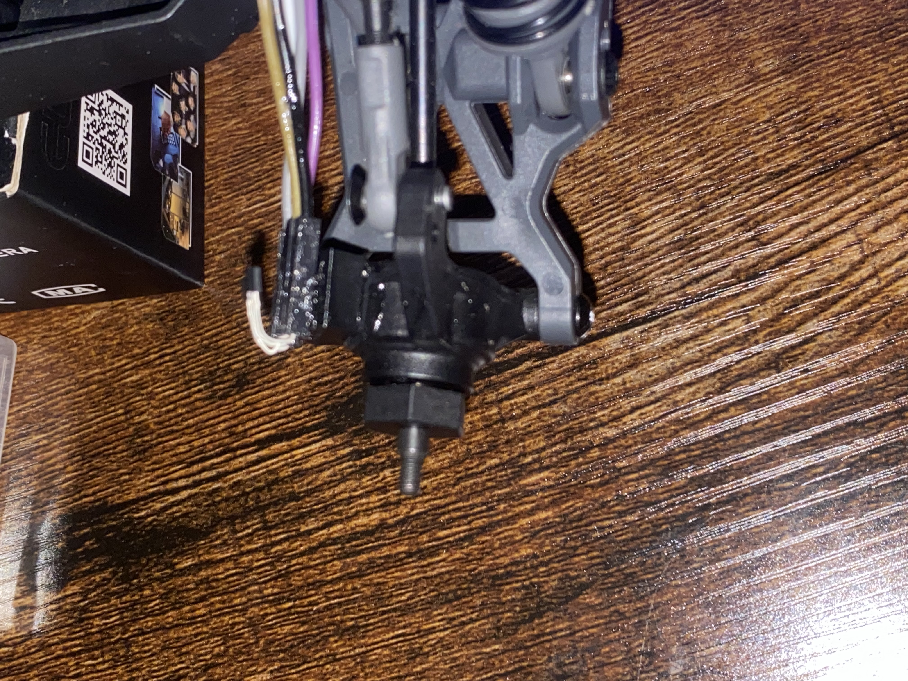

# Wheel Encoder Prototype — V2 Improvements

An improved version of the magnetic wheel encoder described in [Part 1](https://github.com/FouadRobotics/Wheel-Encoder-Prototype). This iteration raises the sensor mount height, tightens the signal conditioning, and adds a full quadrature decoder with software phase alignment directly in firmware.

---

## What Changed From V1

### 1. Raised Sensor Mount Height

The SS49E sensor legs were bent upward to elevate the sensing face, positioning it closer to the center of the passing magnets rather than catching only the fringe of the field. To make this permanent, the 3D-printed holder was epoxy-glued to the car chassis structure, and the female jumper wires connecting to the sensors were also fixed in place with epoxy — eliminating any movement that could shift the sensor position during operation.

The raised height delivers a stronger and more symmetrical analog deflection as each magnet passes — cleaner raw signals that require less hysteresis headroom to decode reliably.







### 2. Per-Channel Hysteresis Thresholds

V1 used a single shared pair of high/low thresholds applied identically to both sensors. V2 defines independent threshold pairs for each channel:

```cpp
const int HIGH_TH_1 = 25;
const int LOW_TH_1  = -25;

const int HIGH_TH_2 = 25;
const int LOW_TH_2  = -25;
```

This makes it possible to tune each sensor independently if one produces a weaker signal or sits at a slightly different distance from the magnets — without affecting the other channel. In V1, a single global threshold forced a compromise between the two sensors. With separate thresholds, each channel can be dialled in to the tightest window its signal strength allows, which improves edge-tracking precision and reduces the chance of missed or false transitions.

### 3. Software Phase Alignment via Delay Buffer

Getting two physical sensors to produce a clean 90° quadrature offset is geometry-dependent and difficult to tune by repositioning hardware alone. V2 introduces a software delay buffer that holds channel 2's state for a configurable number of samples before it enters the decoder:

```cpp
#define DELAY_LEN 3   // adjust 0–5 to tune phase

delayBuffer[delayIdx] = state2;
delayIdx = (delayIdx + 1) % DELAY_LEN;
int alignedState2 = delayBuffer[delayIdx];
```

This shifts channel 2 backward in time by `DELAY_LEN × SAMPLE_PERIOD_US` microseconds — a pure software adjustment that replaces the need to physically reposition the sensor.

### 4. Full Quadrature Decoder with State Machine

V1 only reported raw channel states. V2 adds a complete 4-bit state machine that decodes direction and maintains a running encoder count:

```cpp
int transition = (prevState << 2) | currentState;

switch (transition) {
  case 0b0001: case 0b0111: case 0b1110: case 0b1000:
    encoderCount++;   // forward
    break;

  case 0b0010: case 0b0100: case 0b1101: case 0b1011:
    encoderCount--;   // reverse
    break;

  default:
    currentState = prevState;  // invalid transition — ignore
    break;
}
```

The valid transitions follow a Gray-code pattern. Any two-bit jump (e.g., `00 → 11`) indicates a missed pulse and is discarded rather than corrupting the count.

### 5. Non-Blocking 2 kHz Sampling

V1 used `delay()`. V2 uses a `micros()`-based timer to sample both channels at a fixed 2 kHz rate without blocking the main loop:

```cpp
const int SAMPLE_PERIOD_US = 4000;  // 2 kHz

if (micros() - lastMicros < SAMPLE_PERIOD_US) return;
lastMicros = micros();
```

### 6. Serial Output Now Includes Encoder Count

```
state1, alignedState2, encoderCount
```

All three values stream at 115200 baud, making it straightforward to visualize both the raw channel states and the decoded position count in the Serial Plotter simultaneously.

---

## Firmware

**[Wheel-Enc-Proto/Wheel-Enc-Proto.ino](Wheel-Enc-Proto/Wheel-Enc-Proto.ino)**

No external libraries required. Flash directly to an Arduino Uno (or any ATmega328-based board).

### Calibration

Before running the main sketch, measure each sensor's resting ADC value with no magnet nearby and update `offset1` / `offset2` accordingly. Open Serial Monitor at 115200 baud with the wheel stationary — both values should hover near zero.

### Tuning `DELAY_LEN`

Start with `DELAY_LEN = 3`. In the Serial Plotter, look at the two channel traces:

- If channel 2 **leads** channel 1, increase `DELAY_LEN` to push it back further.
- If channel 2 **lags** channel 1 by more than a quarter cycle, decrease `DELAY_LEN`.
- Target: a clean 90° offset between the two rising edges.

---

## Experiment — Consistent 24 Counts Per Revolution

Despite the software phase alignment, achieving a textbook 90° quadrature offset between the two channels proved difficult to dial in (as visible in the Serial Plotter screenshot below) with the current structure of magnets that are not perfectly separated.


To quantify what the decoder actually produces in practice, a controlled experiment was run: spin the wheel one full rotation by hand and observe the final `encoderCount`. Repeated across multiple trials, the result was a consistent **24 increments per full rotation**.

This is less than the theoretical maximum (56 counts at ×4 with 14 magnets), but it is **repeatable and consistent** — which matters more than the absolute number for a sensor fusion application.

The encoder output will be fused with:

- **IMU** — provides angular rate and attitude
- **Commanded steering angle from the servo** — provides turn radius estimate

With three complementary sources, a modest 24-count-per-rev wheel encoder is sufficient to produce a reliable pose estimate. The fusion filter corrects individual sensor drift; no single source needs to be perfect on its own.

---

## Video Demo

[demo_video.MOV](demo_video.MOV)

---

## Related

- **Part 1 — Original Prototype:** [FouadRobotics/Wheel-Encoder-Prototype](https://github.com/FouadRobotics/Wheel-Encoder-Prototype)
