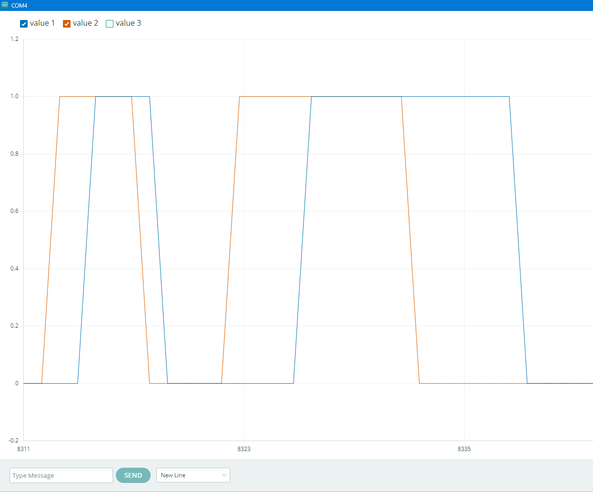

# Wheel Encoder V2: Raised Sensors, Smarter Firmware, and the Reality of DIY Quadrature

*Iteration on a magnetic Hall effect encoder — better hardware geometry, a full quadrature state machine, and an honest look at what "good enough" means in a sensor fusion stack.*

---

In [Part 1](https://github.com/FouadRobotics/Wheel-Encoder-Prototype) of this series I built a magnetic wheel encoder from scratch using two SS49E linear Hall effect sensors, 14 neodymium magnets glued inside the wheel spokes, and a software hysteresis comparator on an Arduino Uno. It worked — but barely. The raw signals were weak, the thresholds had to be wide to avoid false triggers, and the firmware only reported raw channel states with no direction decoding.

This article covers Version 2: a physical change to the sensor mount, a significantly improved firmware, and an honest accounting of what happened when I tried to get proper quadrature alignment.

---

## What Was Wrong With V1

The V1 sensor holder placed the two SS49E sensors at a height that caught only the fringe of the magnetic field from each passing magnet. The signal deflection was small — around ±50 ADC counts at best. That forced a wide hysteresis window (±50 counts) just to avoid chatter, which in turn meant the state transitions were sluggish and the phase relationship between channels was hard to evaluate cleanly.

There was also no direction decoding. V1 output two binary signals and left the counting logic entirely to whatever was reading the serial port.

---

## The Hardware Fix: Raise the Sensors

The fix was simple in concept: redesign the 3D-printed holder to sit the sensors higher — vertically centered on the magnet face rather than catching the bottom edge of the field.

With the sensors at the correct height, each magnet produces a much larger deflection. The signal peak roughly doubled in magnitude. This has a cascade of benefits for the firmware.

---

## The Firmware Overhaul

With stronger raw signals, every downstream processing step could be tightened. The V2 firmware has five meaningful changes over V1.

### 1. Per-Channel Offsets

The SS49E's resting midpoint isn't exactly 2.5 V — it varies slightly per unit. V1 used one shared assumed offset. V2 measures and stores a separate calibrated baseline for each sensor:

```cpp
const int offset1 = 507;
const int offset2 = 499;
```

Each raw ADC reading is zero-centered against its own measured idle value before any comparison.

### 2. Tighter Hysteresis — ±25 Counts Per Channel

The stronger signal from the raised mount allowed the dead-band to be cut in half:

```cpp
const int HIGH_TH_1 = 25;   const int LOW_TH_1 = -25;
const int HIGH_TH_2 = 25;   const int LOW_TH_2 = -25;
```

The comparator still holds its previous state inside the dead zone — that behavior is what prevents chatter — but now it tracks the actual magnet edge much more precisely.

### 3. Software Phase Alignment via Delay Buffer

Getting two physical sensors to produce a clean 90° quadrature offset requires precise mechanical positioning. The spacing between the two sensors has to correspond exactly to a quarter of the magnet pitch — and with a wheel that has 14 magnets unevenly glued by hand, that's nearly impossible to achieve purely through geometry.

V2 solves this in software: channel 2's state is held in a circular delay buffer before entering the decoder. Each slot in the buffer represents one sample period (500 µs at 2 kHz). Delaying channel 2 by `N` samples is equivalent to shifting its phase backward by `N × 500 µs`:

```cpp
#define DELAY_LEN 3   // adjust 0–5 to tune phase

delayBuffer[delayIdx] = state2;
delayIdx = (delayIdx + 1) % DELAY_LEN;
int alignedState2 = delayBuffer[delayIdx];
```

Tune `DELAY_LEN` in the Serial Plotter: if channel 2 leads channel 1, increase the delay; if it lags by more than a quarter cycle, decrease it.

### 4. Full Quadrature Decoder

V1 reported raw channel states and left direction decoding to the host. V2 implements the full 4-bit state machine directly on the Arduino:

```cpp
int transition = (prevState << 2) | currentState;

switch (transition) {
  // Forward: 00→01, 01→11, 11→10, 10→00
  case 0b0001: case 0b0111: case 0b1110: case 0b1000:
    encoderCount++;
    break;

  // Reverse: 00→10, 10→11, 11→01, 01→00
  case 0b0010: case 0b0100: case 0b1101: case 0b1011:
    encoderCount--;
    break;

  default:
    currentState = prevState;  // missed pulse — discard
    break;
}
```

The valid transitions follow a Gray-code pattern where only one bit changes per step. A two-bit jump means a pulse was missed; the state is held rather than corrupting the count.

### 5. Non-Blocking 2 kHz Sampling

V1 used `delay()`. V2 uses a `micros()`-based interval timer:

```cpp
const int SAMPLE_PERIOD_US = 4000;  // 2 kHz

if (micros() - lastMicros < SAMPLE_PERIOD_US) return;
lastMicros = micros();
```

At 2 kHz and with 14 magnets, the encoder can track wheel speeds up to several hundred RPM before missing pulses — more than sufficient for an RC car.

### Serial Output

All three values stream at 115200 baud:

```
state1, alignedState2, encoderCount
```

Plotting all three in the Arduino Serial Plotter lets you see the raw channel states and the decoded count climbing or falling in real time.

---

## The Alignment Problem

Here's where the honest part comes in.

Despite the software phase alignment buffer, getting a clean 90° offset between channel A and channel B proved elusive. The physical geometry of this wheel — 14 hand-placed magnets with imperfect spacing, two sensors mounted on a bracket held with double-sided tape — introduced too much variability for the delay buffer alone to correct.

The Serial Plotter told the story clearly:



Both channels rise and fall nearly together rather than with a clean quarter-cycle offset. The decoder still runs and still counts — but it is not in proper quadrature mode. The directional resolution is reduced, and the count per revolution is lower than the theoretical maximum.

---

## The Experiment: How Many Counts Per Revolution?

Rather than chasing perfect alignment, I ran a direct experiment: spin the wheel exactly one full rotation by hand and read the final `encoderCount`.

The result was consistent across multiple trials: **24 increments per full rotation**.

Compare this to the theoretical ceiling:

| Mode | Counts / Rev |
|------|-------------|
| ×1 (one rising edge, one channel) | 14 |
| ×2 (both rising edges) | 28 |
| ×4 (all edges, both channels) | 56 |
| **V2 actual (misaligned)** | **~24** |

24 counts per revolution is below ×2 but above ×1. It is not a round number that maps cleanly to a specific resolution mode — it reflects the decoder picking up some but not all of the valid transitions due to the near-in-phase signals.

The critical observation is that **the result is consistent and repeatable**. Every full rotation produces the same 24-count increment. That matters far more than hitting a textbook number.

---

## Why 24 Counts Is Good Enough

This encoder does not operate in isolation. It feeds into a sensor fusion stack alongside two other sources:

- **IMU** — provides angular rate and vehicle attitude at high frequency
- **Commanded steering angle from the servo** — provides a turn radius estimate from the control signal

A fusion filter (extended Kalman or similar) takes all three inputs and produces a pose estimate that is more accurate than any single sensor alone. Each source corrects the drift of the others.

In this context, the wheel encoder's job is to provide a **consistent, repeatable** measurement of linear displacement — not a perfect one. 24 well-behaved counts per revolution is enough to give the filter a meaningful signal to work with. The IMU handles angular rate; the servo angle handles turn geometry; the wheel encoder handles longitudinal distance. None of them needs to be perfect individually.

---

## What's Next

The next steps for this build are:

- Permanently mount the sensor bracket with epoxy and re-run the alignment experiment to see if a rigid mount improves the phase offset
- Wire the encoder into the main autonomy stack
- Implement the EKF fusion layer with IMU and servo angle inputs

The full source is on GitHub: [FouadRobotics/Wheel-Encoder-Prototype-V2](https://github.com/FouadRobotics/Wheel-Encoder-Prototype-V2)

---

## References

- Part 1 — Original Prototype: [FouadRobotics/Wheel-Encoder-Prototype](https://github.com/FouadRobotics/Wheel-Encoder-Prototype)
- US Digital — *Resolution, Accuracy, and Precision of Encoders*: [usdigital.com](https://www.usdigital.com/support/resources/reference/technical-docs/white-papers/resolution-accuracy-and-precision-of-encoders/)

---

*Tags: Arduino, Robotics, Embedded Systems, Hall Effect Sensors, Odometry, Sensor Fusion*

---

*[youtube.com/@FouadRobotics](https://www.youtube.com/@FouadRobotics) · [fouadrobotics.com](https://fouadrobotics.com)*
